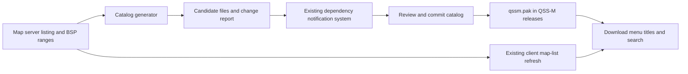

Map download descriptions — implementation plan

Status: implemented locally. The initial scan covered 6,644 maps and extracted 5,866 titles; 740 maps have no title, 26 use unsupported BSP formats, and 12 remain unresolved. The menu, bundled catalog, monthly dependency watcher, regression tests, and maintainer runbook are in place. See `Misc/map-catalog.md` for the operating procedure.

Implementation decisions: process ten maps per batch using bounded HTTP range reads, keeping zero BSP files on disk; emit notification records directly from `update-map-catalog.js`; resolve source case aliases deterministically and report them for review. The findings below record the original planning baseline.

**1. Feature and delivery model**

Show a map's embedded title beside its filename in the Map Downloads menu, and let the existing search match either field. Generate the initial catalog from the map server, bundle the reviewed catalog in `qssm.pak`, and extend the existing GitHub Actions dependency watcher to prepare monthly updates.

Here, “description” means the BSP's `worldspawn` `message`, which is also the source used for installed-map titles. It does not mean an authored synopsis, readme, rating, or compatibility recommendation. Keep titles as supplied by the map, with deterministic conversion to menu-safe text.

The first version uses bundled metadata. It adds no title requests when opening the menu or highlighting a map. New filenames discovered by the existing client-side map-list refresh remain usable immediately; their titles arrive with a subsequent QSS-M package update. An independent live catalog service and automatic update PRs can be considered later if release delays prove inconvenient.

Data flow:



**2. Findings that shape the implementation**

| Existing component | Finding and consequence |
| --- | --- |
| `Misc/qssm_pak/misc/qw_maps.txt` | Contains 6,620 filenames. Its format must stay compatible with existing map completion and downloading. |
| `Quake/console.c`, `QWMapList_Parse` | Accepts a sorted, case-insensitively unique list of valid BSP filenames. Adding title columns here would break parsing. Use a separate catalog. |
| `QWMapList_LoadOnce` | Prefers `id1/backups/qw_maps.txt` over the packaged list. Join titles by filename, never by row number, and handle older caches shadowing a newer packaged filename snapshot after an upgrade. |
| `QW_MAPLIST_REFRESH_SECONDS` | Automatic client refresh currently uses a 180-day cache interval; `qwmaplist reload` can request a refresh. Monthly CI checks do not change that client interval. |
| `Quake/gl_model.c`, `Mod_LoadMapDescription` | Reads the BSP entity lump, extracts the first entity's message, and converts Quake characters to readable text. Use this as the extraction reference. |
| `Quake/host_cmd.c` | Installed maps have a separate `mapdesc.json` cache. Remote catalog records must not become installed-map records. |
| `Quake/menu.c` | The download menu currently draws only filenames, while the installed Levels menu already draws filenames and titles. Preserve download progress, installed styling, and footer messages. |
| `M_PrintScroll2` and `M_PrintHighlightScroll2` | Their column spacing depends on the installed-map global `max_word_length`. Download rows need explicit/local spacing rather than changing that global. |
| `.github/workflows/dependency-watch.yml` | Already has daily, monthly, and manual triggers, tests, issue deduplication, and notifications. Its existing dependency check has a 10-minute timeout, so bulk metadata work needs a separate job. |
| `.github/dependency-watch.json` | Specifically validates DLL/package dependencies. Follow the controller-database checker pattern with a dedicated catalog checker that emits compatible notification records. |
| `Misc/qssm_pak/build.sh` | Packages Git-tracked files under `Misc/qssm_pak`, excluding shell scripts. Keep monitoring state and reports outside this directory, and verify that the new catalog is tracked before checking packaging. |

The [directory fetched during planning](https://maps.quakeworld.nu/all/) contained 6,645 distinct `.bsp` links: 39 apparent additions and 14 apparent removals compared with the bundled list, before URL decoding and applying the production filename validator. The completed extraction decoded those links and found 24 actual additions and no removals. These counts describe one listing and will change. The directory displays rounded sizes and dates without times, which are insufficient to reliably identify same-name replacements.

An earlier probe of `aerowalk.bsp` returned HTTP 206 for a 124-byte header and for a 1,024-byte entity prefix containing `"message" "Aerowalk"`. That proves the extraction approach for one map. A representative pilot must establish coverage and request cost before the initial full run.

**3. User-visible behavior**

Use the existing 320×200 menu layout, 17 visible rows, cursor, scrollbar, and ticker behavior. At rest, reserve up to 12 filename characters plus a gap, followed by the title. Long selected rows scroll to reveal the complete filename and title. Illustrative layout:

```text
             Map Downloads

  aerowalk     Aerowalk
  mapname      Embedded map title
  newmap
```

Rows without metadata retain the existing filename-only rendering, including its full available width. Do not display “unknown,” an extraction failure, or a network indicator in place of a title. Retain filename ordering and the original filename as the download identity.

Search remains a case-insensitive substring search, now applied to the extensionless filename OR its full normalized catalog title. Highlight the matched field and scroll the selected row as today. Two maps with identical titles remain separate entries. Clearing search, deleting words, mouse selection, controller navigation, and no-result behavior retain their current semantics.

During an active download, use the existing filename/progress row and temporarily prioritize progress over the title. Installed entries display filename and title with the current subdued styling. Keep the current success/already-installed/error footer behavior and search-box placement. Searching an installed row should still visibly identify a match without losing its installed appearance.

The download menu uses the catalog title for the downloadable map, including when a local file with the same name is installed. The installed Levels menu continues to use the local BSP/cache. This avoids silently attributing a local mod's same-name map title to the remote file.

**4. Files and data contracts**

| File | Purpose |
| --- | --- |
| `Misc/qssm_pak/misc/qw_maps.txt` | Existing compatible filename snapshot; updated with reviewed catalog batches. |
| `Misc/qssm_pak/misc/qw_map_titles.json` | New small runtime title catalog included in `qssm.pak`. |
| `.github/map-catalog-snapshot.json` | Committed monitoring baseline: source identity, extraction version, per-file validators, and extraction outcomes. Never packaged. |
| `.github/scripts/map-catalog.js` | Shared listing validation, BSP parsing, title normalization, canonical serialization, and comparison functions. |
| `.github/scripts/update-map-catalog.js` | CLI that creates candidate files and reports; supports bootstrap, incremental update, offline validation, and resume. |
| `updates.json` in the candidate directory | Notification record emitted by `update-map-catalog.js` for the existing notifier. |
| `.github/scripts/map-catalog.test.js` | Fixture and mock-server tests for extraction, transport behavior, and change detection. |
| `Misc/stress/test_download_map_titles.py` | Focused harness exercising production C loading, title lookup, filtering, and list replacement behavior. |
| `Misc/map-catalog.md` | Maintainer runbook for regeneration, reviewing artifacts, packaging, and recovery. |

Proposed runtime format:

```json
{
  "schema": 1,
  "source": "https://maps.quakeworld.nu/all/",
  "maps": [
    { "name": "aerowalk.bsp", "title": "Aerowalk" }
  ]
}
```

Canonical identity is an ASCII case-folded full BSP filename. Preserve its original spelling in the filename list and records. Apply the engine's filename restrictions and case-insensitive ordering; choose the bytewise first spelling for case variants deterministically and record aliases in the review report. Titles are plain printable ASCII after Quake character conversion, whitespace cleanup, and a 127-byte maximum. Store the complete allowed title and let drawing clip/scroll it. This has an independent bound from the installed cache's current 49-character payload, so that older limit does not silently truncate the new catalog.

Represent a successfully parsed, titleless worldspawn with an empty title. Omit unresolved new maps from the runtime title catalog; they still appear in `qw_maps.txt`. In the monitoring snapshot distinguish `title`, `no_title`, `unsupported_bsp`, and `unresolved`. Keep transient failure details and run timestamps in reports/checkpoints, rather than generating committed diffs every run.

For successful records, store the exact byte length, available ETag/Last-Modified values, the extractor version, and a digest of extracted metadata. Separate the most recently observed remote validator from the validator of the successfully extracted title: a failed replacement fetch must not make an old title look current. Persist the link between the baseline and its runtime catalog using a content digest checked during offline validation.

Sort deterministically and omit volatile generation dates from canonical data. Preserve a filename snapshot's `# refreshed=` timestamp when its names do not change; assign it the listing capture time only when generating a changed snapshot. This uses the same comment convention as the current runtime cache and remains compatible with older parsers. Reusing an unchanged baseline or captured listing must reproduce identical files. Compute the notification revision from the meaningful candidate file set, including persistent extraction state, excluding run times and snapshot timestamps. Repeated checks of the same changes then produce the same notification identity even when collected on different days. Validator-only changes can be reported as baseline maintenance with zero title changes.

**5. Extracting titles without full map downloads**

Implement the generator with the Node.js runtime already used by the watcher and built-in HTTP, file, crypto, and test facilities. No new npm package is necessary. Treat BSP data as bytes, not UTF-8 text, before applying the Quake character conversion.

The extraction sequence is:

1. Fetch a bounded listing from the configured HTTPS source. Parse relative BSP links, normalize them using engine-compatible rules, and validate the complete result before treating omissions as removals. Store listing hints for diagnostics only.
2. Request bytes 0–123 of a candidate BSP with identity content encoding. Validate status, returned byte interval, complete resource length, and the exact header size.
3. Parse the little-endian header and support the same header families recognized by the engine: Quake BSP29, both supported BSP2 signatures, and Quake64. Reject unsupported formats explicitly.
4. Check the entity lump's offset and length against the resource length with overflow-safe arithmetic. Handle empty or malformed lumps as extraction outcomes, never as map-install instructions.
5. Fetch an initial entity prefix of up to 4 KiB. If the first entity is incomplete, expand within the declared lump to a 64 KiB ceiling. Exceeding that ceiling is unresolved, not proof of an empty title.
6. Tokenize the first entity using Quake-compatible quoting/comment rules, verify it is worldspawn, and read `message`. Do not regex-search arbitrary later entities for a message. A missing message is confirmed only after the first entity is fully parsed.
7. Apply the engine's dequake mapping and newline cleanup, normalize remaining whitespace/control bytes, and bound the result. Preserve ordinary punctuation and casing. Test representative normalization results against the production C extractor where applicable.
8. Record the outcome and discard fetched BSP bytes after producing the metadata/checkpoint.

For range requests, validate HTTP 206 and Content-Range; do not assume the server honored Range. If the server returns a complete HTTP 200 body, abort it within the response cap and report unsupported range behavior. V1 has no automatic full-file fallback. Pin subsequent reads to the same representation using a usable strong ETag/If-Range, or a valid Last-Modified strategy, and restart a bounded number of times if the representation changes. If validators are unavailable, report that limitation and perform bounded repeated header/metadata checks rather than claiming an atomic remote snapshot. These checks follow [HTTP range and conditional-request semantics](https://www.rfc-editor.org/rfc/rfc9110.html#name-range).

Use a clear QSS-M catalog user agent, at most two concurrent requests, and an initial global ceiling of four requests per second. Set connect/request timeouts, a finite retry budget, and Retry-After handling for throttling. Restrict redirects to the configured HTTPS source policy. Apply byte limits while streaming so a server ignoring Range cannot turn a metadata run into an accidental bulk download.

Pilot roughly 30–50 representative maps, covering old/new filenames, long names, titleless or unusual titles, and any available non-BSP29 examples. Record bytes transferred, requests per map, latency, and extraction outcomes. At 6,620 maps, two requests per map and four starts per second imply roughly 55 minutes just from pacing. This is an estimate, not a promised duration; expanding lumps, retries, and latency increase it. A 4 KiB prefix plus header for every map is about 27 MiB of response bodies before overhead and retries.

**6. Initial generation, incremental updates, and removals**

Bootstrap runs locally or by an explicit manual workflow mode, in resumable batches. Checkpoints contain only metadata and progress. Resume only when the source, schema, extraction version, and record validators still match. A lost Actions cache must never lose the reviewed baseline; committed data is authoritative, while checkpoints are disposable accelerators.

Attempt every valid current filename for the first catalog. Produce counts for titles, confirmed empty titles, unsupported files, and unresolved failures. Report complete coverage honestly: a valid map without a title is not an extraction failure, and a timeout is not a confirmed empty title. Review unresolved outliers before shipping; retaining filename fallback is allowed and documented.

On each monthly incremental run:

1. Fetch and validate the current listing and compare filename sets.
2. Identify newly added names and previously unresolved records for extraction.
3. Revalidate existing names using HTTP validators and exact length, with conditional HEAD where supported. Use a bounded header range when HEAD is unavailable. Listing dates/rounded sizes are only hints and do not replace these checks.
4. Extract new or changed BSPs. Reuse verified metadata for unchanged files, including confirmed empty titles. A normalization/extractor-version change schedules re-extraction of affected records even if the file did not change.
5. Generate a report and internally consistent candidate files. Preserve the last successfully extracted title on a transient failure and mark it stale/unresolved in monitoring state; never overwrite it with an invented empty title.

HTTP validators provide best-effort replacement detection. A source that changes content while preserving all validators can evade this process. Provide a manual `--reextract-all` mode to audit/rebuild titles without trusting validators; do not promise perfect same-name change detection without reading every relevant title again.

Flag all missing filenames in the review report. Refetch a structurally valid listing before proposing removals. Reject an empty listing, a detected error page, or an unexpectedly large count drop as a failed refresh; initially flag a drop greater than 5% for explicit investigation. That threshold is an operational guard, not proof that a smaller drop is correct. Successful candidates may include removals, but reviewed files remain intact until the maintainer accepts the batch.

When the source is unreachable or a listing is invalid, produce diagnostics and leave the last good data unchanged. Isolated per-map failures may produce a clearly marked partial candidate with old known titles and new filename-only entries. Repeated broad failures should terminate extraction early and produce a failed-run report instead of a misleading routine catalog update.

**7. Runtime loading and memory ownership**

Keep the implementation close to `QWMapList` in `Quake/console.c` and expose the narrow menu-facing API in `Quake/console.h`, avoiding new platform project entries. Proposed functions are `QWMapTitles_LoadOnce`, `QWMapTitles_TitleForName`, and `QWMapTitles_Invalidate`; exact names may follow implementation conventions.

Load `misc/qw_map_titles.json` lazily when entering the download menu. Check the file length before allocation and parse it once using the existing JSON parser. Proposed hard limits are 8 MiB total, 100,000 records, valid BSP names, and 127 printable title bytes. Validate schema, field types, source identity, unique ordering, and title characters. An invalid/missing catalog logs one diagnostic and yields empty lookups; it must never disable map-list loading or downloads.

Build a sorted index and use case-insensitive binary search. Associate titles with the loaded menu's rows once at initialization/refilter time instead of reparsing JSON or scanning the entire catalog each frame. Borrowed string pointers must remain owned by a live catalog allocation. Invalidation must discard dependent menu state before freeing that allocation, or copy bounded titles into menu-owned rows.

Tie catalog invalidation to explicit metadata reload and mounted game/search-path changes. Extend `qwmaplist info` with catalog state, source path, title count, and matched/missing coverage. `qwmaplist reload` can reload bundled metadata locally while retaining its current remote filename-refresh behavior; it must not imply that an updated title catalog was downloaded.

When choosing between a cached and packaged filename list, prefer the newer valid snapshot using their `# refreshed=` metadata. This is a narrow change to the existing unconditional cache preference: an old six-month cache must not hide maps shipped in a newer release, while a genuinely newer remote cache must retain its additions/removals. For legacy cached files without a usable timestamp, use their file modification time; an undated legacy packaged list remains the fallback. Validate timestamps and ignore implausible future values. If time comparison is unavailable or tied, retain the existing cache preference. Do not overwrite either list just to select it, merge removed names back in, or change the automatic 180-day network interval. Validate both candidates before choosing, and continue to fall back on malformed/missing data.

Audit list replacement while the download menu is open. Existing filtered indices refer to a particular map-list ordering, and consuming a refresh replaces that storage. Introduce a monotonically changing list generation if needed, rebuild filtered indices before using a changed list, and preserve selection by copied filename. Reset the ticker if the selected identity changes, including when its numeric row remains the same. Include an equal-count/reordered-list test, since count checks alone are insufficient. Continue completion and download submission to use filenames only.

The JSON catalog and installed `mapdesc.json` remain independent. Do not populate `extralevels` from the remote catalog or persist downloaded-map titles into the installed cache before the map exists locally.

**8. Menu integration details**

Add the title lookup to `M_DownloadMaps_Refilter` and row drawing. Retain full-width filename rendering when no nonempty title exists. Factor or adapt the existing two-string scrolling helpers so the download menu supplies its own column width. Preserve the installed Levels menu's existing output through a wrapper if a shared helper gains an explicit width parameter.

Keep active-download rendering first in draw precedence, followed by installed appearance, then normal/highlighted title rows. Reuse the scrolling geometry and separator behavior across normal, installed, and search states to avoid inconsistent clipping. Avoid changing global `max_word_length` based on the remote list.

Treat displayed text as data: title contents never enter `Cbuf_AddText`, paths, URLs, or download commands. The selected underlying BSP filename remains the sole identifier for Enter, optional-file checking, progress tracking, and completion.

**9. GitHub Actions integration**

Extend `dependency-watch.yml` on its existing monthly schedule and on manual dispatch. Daily DLL checks retain their existing cadence. Add a manual input for ordinary incremental checking versus initial/full generation, with the existing behavior remaining the default for other dependencies.

Use a separate read-only `map-catalog` job after the monitor tests. Start with a 90-minute job timeout and a soft stop at 75 minutes for incremental work; use a longer, explicit manual bootstrap limit with resumable batches. Tune these values using the pilot. Do not put the scan under the existing 10-minute dependency job.

Upload a candidate artifact containing:

- Proposed `qw_maps.txt`, `qw_map_titles.json`, and monitoring snapshot, preserving their repository-relative paths.
- A readable report of additions, changed titles, removals, stale records, and extraction failures.
- A machine-readable update record, candidate digest, base commit, tool/schema versions, and request/byte statistics.
- A resumable checkpoint when work is incomplete.

Set artifact retention explicitly, initially to 90 days subject to repository limits. Include a rerun command in the report because artifacts can expire or disappear when their workflow run is deleted. Artifacts are review outputs, not the durable baseline. See [GitHub's artifact documentation](https://docs.github.com/en/actions/concepts/workflows-and-actions/workflow-artifacts) and [retention behavior](https://docs.github.com/en/actions/how-tos/manage-workflow-runs/remove-workflow-artifacts).

Add a short `map-catalog-notify` job after a usable candidate exists. It downloads the update record and calls the existing `notify-dependency-updates.js`. Use a stable package identity such as `qssm/qw-map-catalog` and the canonical candidate digest as `packageVersion`, so rerunning an unchanged batch does not notify again. Include coverage and the report/run link in its reasons/details. Keep filename/title text out of notification markers and escape report table content.

Give extraction only `contents: read`; give the notifier the same `contents: read` and `issues: write` permissions already used by the watcher. Serialize the notification job with the existing `dependency-update-watch` concurrency group to avoid overlapping issue deduplication. Keep the new extraction job's result independent so an unavailable map server does not suppress existing DLL/controller notifications.

No new automatic commit, pull request, or merge is required for v1. Avoid changing the existing notifier's deduplication and superseding behavior unless metadata-specific report links require a narrowly scoped extension. Store map state separately from the DLL manifest. Pin any added artifact actions to reviewed commit SHAs in the repository's existing style.

Validate generator fixtures and committed catalog consistency offline in normal relevant PR/build CI as well as the scheduled watcher. The watcher currently has no push/PR trigger, so adding tests only to that workflow would not validate new implementation changes at PR time. Avoid any live catalog regeneration during release builds.

**10. Maintainer update and release procedure**

The notification provides the candidate revision, base commit, counts, failures, and artifact/run link. Review especially renamed/removed maps, unexpected title changes, partial coverage, and source-validator changes. Regenerate/rebase the candidate if its base catalog changed after the scan.

Apply the reviewed filename list, title catalog, and monitoring snapshot together. Run the offline consistency validator and relevant tests, ensure new source files are Git-tracked, and build `qssm.pak` through `Misc/qssm_pak/build.sh`. Inspect the PAK directory to confirm the title file is present and monitor/report files are absent. Existing Windows, Linux, and macOS packaging paths already invoke this build script; verify each release path still includes the rebuilt PAK.

Updated titles reach users when they install the new release/package. Existing installations do not receive metadata merely because an issue was opened or a candidate artifact was generated. A client that discovers a new map first will display its filename until that package arrives. This delivery delay and the independent 180-day client list refresh must be stated in the maintainer documentation.

For rollback, revert a reviewed catalog batch and its baseline together, then rebuild the PAK. A missing/invalid catalog falls back to filenames, so metadata rollback does not require reverting the download feature. Keep runtime schema 1 backward compatible; future incompatible formats should fail to filename fallback on older engines.

**11. Validation and acceptance criteria**

| Layer | Meaningful checks |
| --- | --- |
| BSP extraction | Valid supported headers; bad versions; truncated headers; overflow/out-of-file lump bounds; complete/incomplete worldspawn; misleading later messages; missing/empty titles; quoting/comments; Quake high-bit characters; newline cleanup; maximum title length. |
| HTTP behavior | Mock 206/304/200/404/416/429/5xx responses; ignored Range; incorrect Content-Range; short bodies; byte caps; validator changes between reads; request cancellation; finite retries and resume. |
| Generator | Unsorted/duplicate/case-colliding links; engine name limits; additions/removals; same-name validator changes; unchanged titleless maps; stale-title retention; failed listing protection; deterministic output; unchanged rerun; extractor version changes. |
| Runtime loader | Valid/missing/malformed/oversized catalog; unknown schema/source; case-insensitive lookup; catalog/list mismatch; newer packaged list versus older cache and vice versa; legacy/invalid snapshot timestamps; duplicate/invalid rows; repeated open/reload/game switch; allocation cleanup. Exercise production C code, not a reimplementation. |
| Menu | Filename and title search; matches beyond visible clipping; missing-title fallback; duplicate titles; long selected rows; installed styling; download progress; completion message; input/navigation; list replacement preserving the selected filename. |
| Watcher | Monthly/manual gating; daily checks unaffected; artifact/report generation; stable digest and issue deduplication; metadata-only notification; source failure leaves existing dependency notifications functional. |
| Packaging | Real `qssm.pak` contains the reviewed catalog, excludes monitor state, and is included in existing release archives. Offline packaging succeeds without the map server. |

Run `node --test .github/scripts/*.test.js` for the existing and new monitor tests. Add a focused C harness following the production-code extraction style of `Misc/stress/test_map_categories.py`, and run the existing map-category regression after any shared menu change. Run the console-completion regression if its shared list APIs change. Build the engine and use isolated game data/configs for visual smoke checks; use the normal platform CI matrix to catch portability issues.

For visual validation, compare normal, searching, installed, downloading, and long-title states at the base menu canvas and common menu scales. Observe opening/filtering time with the full catalog and with a larger synthetic input. Pass criteria are no title-related HTTP traffic during menu use, no repeated parsing per frame, correct selected download identity, no overlap with progress/footer/search UI, and continued operation with metadata unavailable.

The feature is ready when every map attempted in the initial snapshot has an explicit extraction outcome, unresolved gaps are reported, bundled titles are searchable before downloading, unknown maps retain working filename downloads, scheduled updates are reviewable and repeatable, and all relevant runtime/packaging regressions pass. Coverage percentage should be measured and reported, not guessed in advance.

**12. Implementation sequence**

| Stage | Deliverable and exit condition |
| --- | --- |
| A — extraction and contract | Implement schema, listing/BSP parser, normalization, bounded HTTP client, and fixture tests. Run the small live pilot and record actual coverage/cost. |
| B — initial catalog | Run resumable generation, review unresolved records and removals, and produce the first matching filename/catalog/baseline set. Confirm deterministic regeneration and offline validation. |
| C — engine loading | Add lazy catalog loading, filename lookup, diagnostics, snapshot freshness selection, and memory/list-generation handling. Demonstrate safe fallback, upgrade, and reload behavior with production-code tests. |
| D — menu display/search | Add title rows and search while preserving state styling, scrolling, input, and actual download identity. Complete visual checks and installed-menu regression coverage. |
| E — monthly maintenance | Add independent extraction/artifact and notification jobs to the existing watcher, stable deduplication, manual modes, and the maintainer runbook. Test mocked notifications before a real manual workflow run. |
| F — packaging and release | Verify PAK contents, platform builds, release archives, offline behavior, and a representative end-to-end download. Ship the reviewed catalog and engine support together. |

Stages A/B establish real data quality before UI assumptions are finalized. Stage E uses the same generator as B so initial and recurring extraction cannot drift. A maintainer can update catalog files without rerunning the full bootstrap; unchanged maps normally require validation only.

Further work should be driven by observed needs: delivery between engine releases, automatic update PRs, broader descriptions from readmes, or thumbnails. The planned first release delivers title display/search, a complete generation path, monthly maintenance through the current dependency watcher, and reliable filename fallback.
